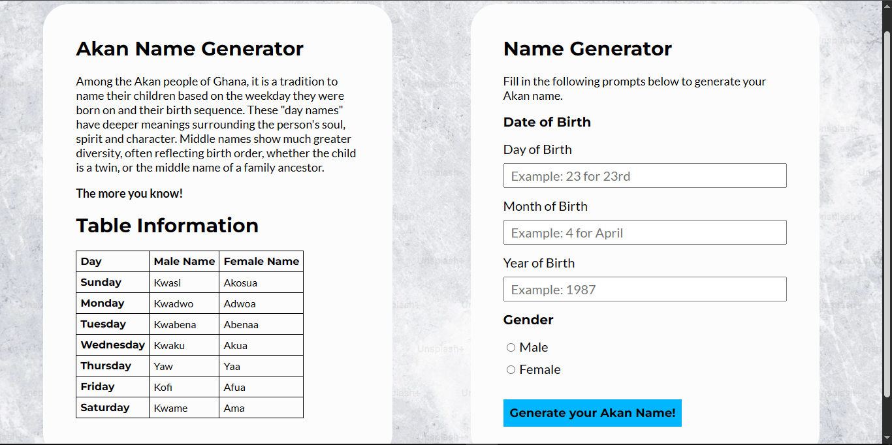

# Akan Name Generator
> An Akan name generator that generates your Akan name based on your date of birth. Each Akan name corresponds to a day of the week.

## Live Demo
[Try it here!](https://s1mpleyz-x.github.io/Akan-Name-Generator/)

## Technologies Used
* `HTML`
* `CSS`
* `JavaScript`

## Setup and Installation
1. Clone the repository
```bash
   git clone https://github.com/s1mpleyz-x/Akan-Name-Generator.git
```
2. Navigate into the project folder
```bash
   cd Akan-Name-Generator
```
3. Open `index.html` in your browser
   - Double-click the file, or
   - Use a tool like VS Code's Live Server extension for auto-reloading during development

> [!WARNING]
> The background image path in `styles.css` is relative to the project root. If you move `pictures/` or restructure folders, update the `background-image` path in `styles.css` accordingly.

## How it works
Akan day names are traditional Ghanaian names assigned based on the day of the week a person is born on. A date of birth is entered, and the generator calculates the corresponding day and returns an Akan name.

## License
[MIT License](LICENSE)


